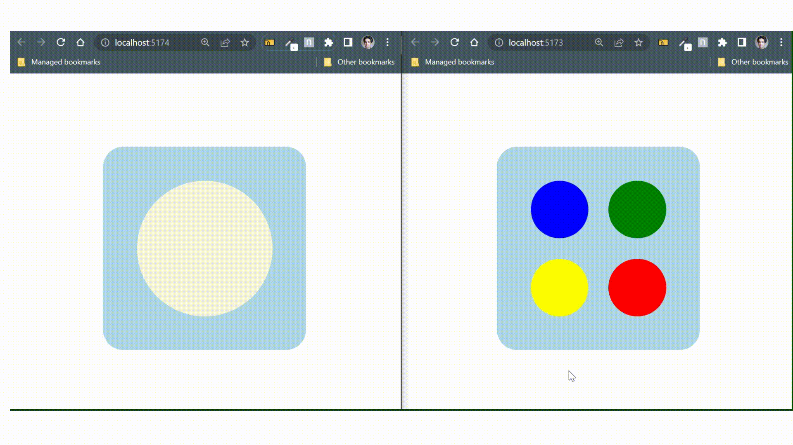
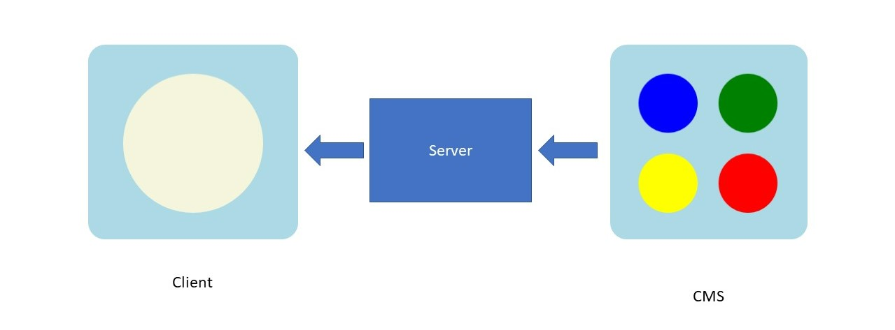

# Project
## WebSocket React Simple Example
This is a simple example of two `client`s talking to each other over a server. `Client 1` (here we call it `CMS`), sends a color to `Client 2` (simply, `Client`).



<br/>

## Why
If you want to get updated data from your `server` over `REST` or `GraphQL`, you have to call the `server` everytime to get the updated data.
What if you want the server to let you know, if any changes have happened? Here you need a [`WebSocket`](https://developer.mozilla.org/en-US/docs/Web/API/WebSockets_API) connection. It is a connection that opens up, and closes only at the end of the use, unlike `REST` that opens and closes on every request. It is vastly used in gaming, chatting applications or wherever you need constant communication between two clients.
<br>
## Run
After cloning, all you need to do is \
Download the dependencies:\
```
npm i
```
and run it:
```
npm start
```
`lerna` will take care of all the three packages:
## Packages (File Structure)
There are two `client` side and a `server` application running. One `client` sends a color to the other one, and the other one shows it. The sender `client` is calld `CMS` which stands for `Content Management System`. This is how the `client` that manages the content is normally called. The receiver `client` is called `Client`.\
These two communicate through `Server`.

 ## How it works
 `CMS` sends an object with a color to the `Server`. `Server` takes it, looks over the `clients` it has an open `WebSocket Connection` with, and sends it to the `Client`.

 